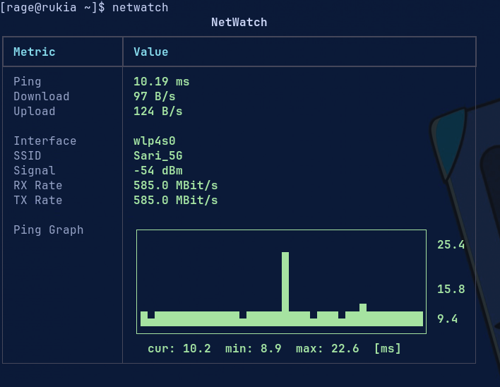
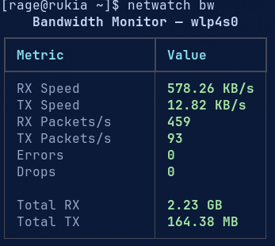
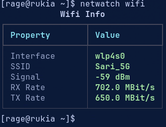
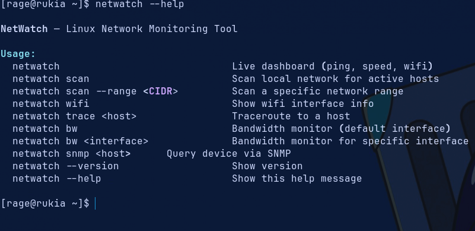

# NetWatch

A terminal-based network monitoring and diagnostic tool for Linux.
Built with Python and Rich for clean, real-time output.


## Screenshots

### Live Dashboard


### Bandwidth Monitor


### Wifi Info


### Help


## Features

- **Live Dashboard** — real-time ping, download/upload speed, wifi signal and link info
- **Network Scanner** — discover active hosts with MAC address, vendor, device type, hostname and open ports
- **Bandwidth Monitor** — per-interface RX/TX speed, packet rate, errors and drops
- **Traceroute** — hop-by-hop path analysis with RTT and hostname resolution
- **Wifi Info** — interface, SSID, signal strength, link speed
- **SNMP v2c** — query network devices for system info and interface table

## Installation

```bash
curl -fsSL https://raw.githubusercontent.com/WhoamiRAGE/NetWatch/main/install.sh | bash
```

Or manually:

```bash
git clone https://github.com/WhoamiRAGE/NetWatch.git
cd NetWatch
pip install -e . --break-system-packages
```

## Usage

```bash
# Live dashboard (ping, speed, wifi, ping graph)
netwatch

# Network scan
netwatch scan                           # Scan local network (auto subnet)
netwatch scan --range 10.0.0.0/24      # Scan a specific CIDR range

# Bandwidth monitor
netwatch bw                             # Default interface
netwatch bw wlp4s0                      # Specific interface

# Traceroute
netwatch trace 8.8.8.8                 # Trace by IP
netwatch trace google.com              # Trace by hostname

# Wifi info
netwatch wifi

# SNMP
netwatch snmp 192.168.1.1             # Query with default community (public)
netwatch snmp 192.168.1.1 private     # Query with custom community string

# General
netwatch --version
netwatch --help
```

## Requirements

- Python 3.10+
- Linux
- `iw` — for wifi info
- `traceroute` — for traceroute (`sudo pacman -S traceroute`)
- `net-snmp` — for SNMP (`sudo pacman -S net-snmp`)
- Root recommended for full scan results (MAC address resolution)

## Project Structure
<<<<<<< HEAD

```
netwatch/
├── cli.py        # Entry point, command routing
├── dashboard.py  # Live dashboard
├── scan.py       # Network scanner
├── ports.py      # Port scanner
├── device.py     # Device type detection
├── vendor.py     # MAC vendor lookup
├── wifi.py       # Wifi info
├── network.py    # Network speed
├── ping.py       # Ping
├── bandwidth.py  # Bandwidth monitor
├── trace.py      # Traceroute
├── snmp.py       # SNMP v2c
└── graph.py      # Ping history graph
```
=======
```text
netwatch/
├── cli.py         # Entry point, command routing
├── dashboard.py   # Live dashboard
├── scan.py        # Network scanner
├── ports.py       # Port scanner
├── device.py      # Device type detection
├── vendor.py      # MAC vendor lookup
├── wifi.py        # WiFi information
├── network.py     # Network speed test
├── ping.py        # Ping utility
├── bandwidth.py   # Bandwidth monitor
├── trace.py       # Traceroute
├── snmp.py        # SNMP v2c support
└── graph.py       # Ping history graph
```

>>>>>>> 4d035dd302876642f2ddf28b07309edbb283c7bd
## License

MIT
